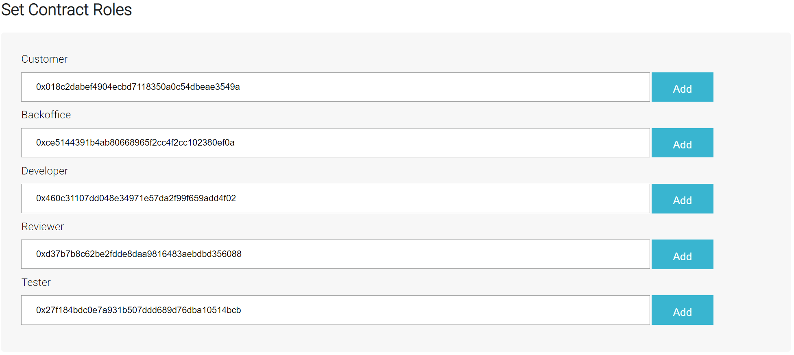
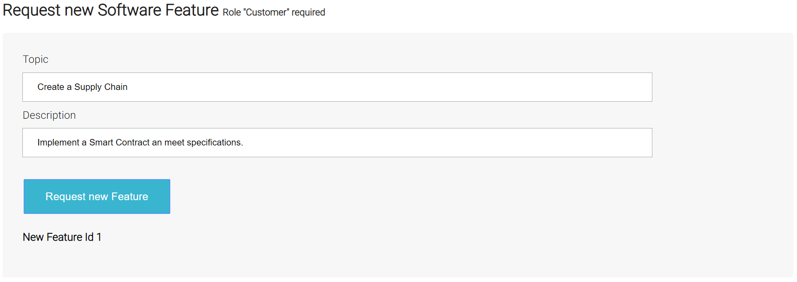
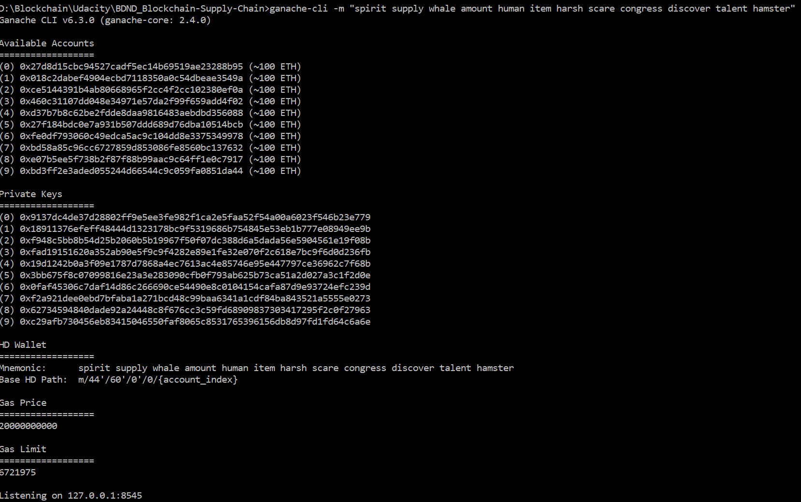
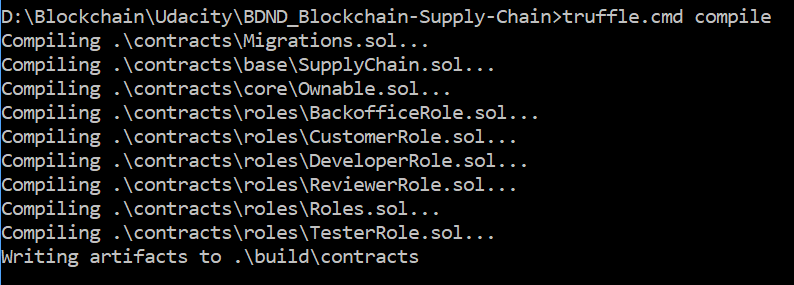
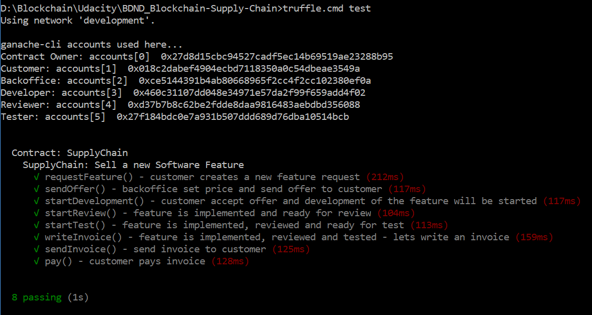

# Supply chain & data auditing

#### General Information
This repository contains an Ethereum DApp that simulates a supply chain from software requirements through implementation, review, testing, invoicing and paying.  
The process is simplified in this example.  
1.)	The customer requests a new feature by means of a topic and a description.  
2.)	The back office determines the price and sends an offer to the customer.  
3.)	The customer accepts the offer and releases it for development.  
4.)	The developer implements the feature and conducts a code review with the reviewer.  
5.)	After a successful review, the review releases the feature for testing.  
6.)	The tester lets write the invoice after successful test.  
7.)	The back office sends the invoice to the customer.  
8.)	The customer pays for the new feature.  

#### GUI Description
The GUI is divided into 5 sections:  
1.)	Query feature information via "Feature Id"  
2.)	Specifying the allowed addresses for a specific role  
    _Here you can define which address has which role.  
    The roles are defined for the contract and are regarded as authorizations.  
    The address that was the sender of the transaction for the respective action is then set in the feature itself._
      
3.)	Creating a New Feature Request  
4.)	Send the offer to the Customer  
5.)	Execution of the individual steps in the workflow.  
6.) History of executed Transactions

**Attention:**  
The GUI describes which action is to be executed with which role.







## Getting Started

These instructions will get you a copy of the project up and running on your local machine for development and testing purposes. See deployment for notes on how to deploy the project on a live system.

### Prerequisites

Please make sure you've already installed ganache-cli, Truffle and enabled MetaMask extension in your browser.

[Truffle Framework](https://truffleframework.com)  
[Metamask](https://metamask.io/)

### Installing

A step by step series of examples that tell you have to get a development env running

Clone this repository:

```
git clone https://github.com/tobiassteidle/BDND_Blockchain-Supply-Chain
```

Change directory to ```BDND_Blockchain-Supply-Chain``` folder and install all requisite npm packages (as listed in ```package.json```):

```
cd BDND_Blockchain-Supply-Chain
npm install
```

Launch Ganache:

```
ganache-cli -m "spirit supply whale amount human item harsh scare congress discover talent hamster"
```

Your terminal should look something like this:



In a separate terminal window, Compile smart contracts:

```
truffle compile
```

Your terminal should look something like this:



This will create the smart contract artifacts in folder ```build\contracts```.

Migrate smart contracts to the locally running blockchain, ganache-cli:

```
truffle migrate
```

Your terminal should look something like this:


Test smart contracts:

```
truffle test
```

All 8 tests should pass.



In a separate terminal window, launch the DApp:

```
npm run dev
```

## Built With

* [Ethereum](https://www.ethereum.org/) - Ethereum is a decentralized platform that runs smart contracts
* [IPFS](https://ipfs.io/) - IPFS is the Distributed Web | A peer-to-peer hypermedia protocol
to make the web faster, safer, and more open.
* [Truffle Framework](http://truffleframework.com/) - Truffle is the most popular development framework for Ethereum with a mission to make your life a whole lot easier.


## Authors

See also the list of [contributors](https://github.com/your/project/contributors.md) who participated in this project.

## Acknowledgments

* Solidity
* Ganache-cli
* Truffle
* IPFS
